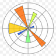

# Steven Yan (@datascisteven) 

## 👋 Thanks for visiting my Github page.

## Projects in Progress and Wish List:

1. **Omdena Hackathon:** Object Detection and Image Segmentation on Satellite Imagery
2. Housing Prediction and Time Series
3. Mobile Deployment with Flutter
4. Music Classification
5. Election Dashboard

## Projects (Mostly) Completed:

1.  **Esteem Equalithon:** SMS Appointment Reminder Webapp
	- _Technologies:_   Python, Twilio, Flask, Redis, Celery, Heroku
	- _Status:_  Flask webapp deployed on local development
	- _Stretch Goals:_  Use of Docker and Heroku for Deployment
2.  **DataKind DataDive Event:** Broadband Access Project with CDAC at UChicago
	- _Technologies:_   Python, Numpy, Pandas, Geopandas, Tableau, SciPy, Scikit-learn, Matplotlib
	- _Status:_  Created Tableau visualizations and pipeline for data processing
	- _Stretch Goals:_ None
3.  **Flatiron Hackathon:** Flictionary
	- _Technologies:_  Python, Numpy, Pandas, Matplotlib, Seaborn, Tensorflow, Scikit-learn, Pillow, PyTorch
	- _Status:_ 
	- _Stretch Goals:_ 
4.  Melanoma Image Classification
	- _Technologies:_  Python, Numpy, Pandas, Tensorflow, Keras, Scikit-learn, OpenCV, Scikit-image, Matplotlib, Seaborn
	- _Status:_  Flask App deployed on local development, ResNet50 model at 91% and 80% holdout accuracy
	- _Stretch Goals:_  Using PyTorch instead of Tensorflow and develop Flutter implementation
5.  Hate Tweet Detection
	- _Technologies:_   Python, Numpy, Pandas, Tensorflow, Keras, Scikit-learn, NLTK, Matplotlib, Seaborn
	- _Status:_  Machine Learning Model deployed on Heroku
	- _Stretch Goals:_ Explore additional NLP tools like SpaCy 
6.  Taiwanese Credit Card Default Prediction
	- _Technologies:_   Python, Numpy, Pandas, Scikit-learn, SciPy, Tableau, Plotly
	- _Status:_   
	- _Stretch Goals:_ 
7.  The Masked Politic
	- _Technologies:_   Python, Numpy, Pandas, Geopandas, Scikit-learn
	- _Status:_
	- _Stretch Goals:_  
8.  King County Housing Price Prediction
	- _Technologies:_  Python, Numpy, Pandas, Geopandas
	- _Status:_  
	- _Stretch Goals:_
9.  Movie Analysis
	- _Technologies:_ 
	- _Status:_
	- _Stretch Goals:_

## Blog Posts Published:

1. How To Enhance Your Visualizations for Exploratory Data Analysis Using Seaborn and FacetGrid
2. The Lesser of Two Evils in Machine Learning
3. To RegEx or Not To RegEx? (Part I)
4. To RegEx or Not To RegEx? (Part II)
5. How To Show Your Minority Class Much-Needed TLC
6. How To Create Your Own Hate Tweet Detector

## My Contact Info:

## Technologies in Use:
                    
### Used Almost on Daily Basis:

### Used on a Regular Basis:

### Used on Occasional Basis:

